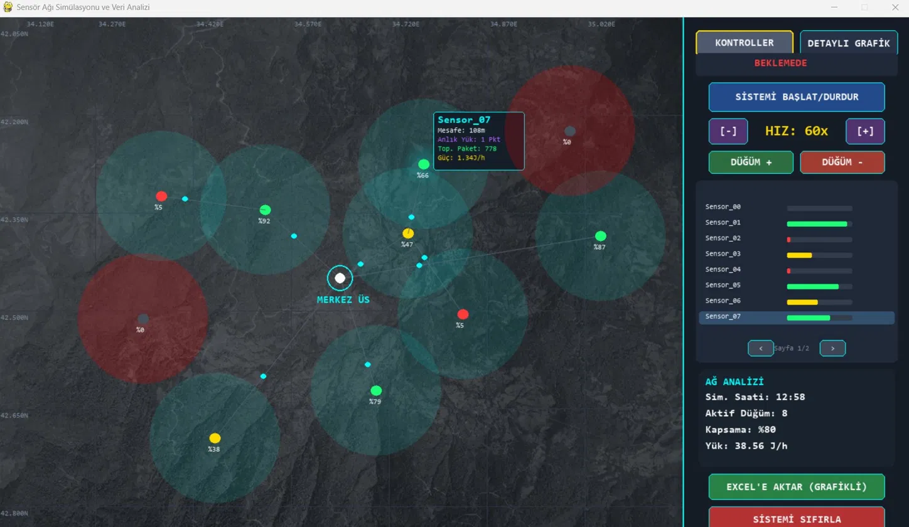

# 📡 Sensör Ağı Simülasyonu ve Veri Analizi

> **Sensör Sayısı ve Veri Gönderim Sıklığının Ağ Trafiğine Etkisinin Simülasyonu**

---

## 🎓 Proje Bilgileri

| | |
|---|---|
| **Öğrenci** | Mehmet Torun |
| **Numara** | 24370031081 |
| **Teknoloji** | Python / Pygame |
| **Ders** | Bilgisayar Ağları / Kablosuz Sensör Ağları |

---

## 📌 Proje Hakkında

Bu proje, **Kablosuz Sensör Ağlarının (WSN)** gerçek zamanlı simülasyonunu gerçekleştiren, görsel ve etkileşimli bir masaüstü uygulamasıdır. Temel araştırma sorusu şudur:

> *"Sensör sayısı ve veri gönderim sıklığı artırıldığında ağ trafiği ve enerji tüketimi nasıl değişir?"*

Simülasyon; düğümlerin harita üzerinde yerleştirilmesini, paket iletimini, batarya tüketimini ve anlık ağ yük dağılımını görselleştirir.

---

## 🖼️ Ekran Görüntüsü

### Canlı Simülasyon



*Simülasyon çalışırken alınan ekran görüntüsü — Sensor_07 seçili, batarya renkleri ve kapsama alanları görünmekte.*

---

## 🚀 Özellikler

| Özellik | Açıklama |
|---|---|
| 🗺️ **Harita Üzerinde Görselleştirme** | Sensör düğümleri ve merkez istasyon coğrafi koordinatlarla harita üzerine yerleştirilir |
| 📦 **Gerçek Zamanlı Paket Animasyonu** | Her sensörden merkeze akan veri paketleri canlı olarak gösterilir |
| 🔋 **Batarya Simülasyonu** | Mesafe ve yük miktarına bağlı dinamik enerji tüketimi hesaplanır |
| 📈 **Canlı Grafik Paneli** | Anlık ağ yükü ve düğüm bazlı toplam paket transfer grafikleri |
| ⚡ **Hız Kontrolü** | Simülasyon hızı `1x`'ten `1200x`'e kadar ayarlanabilir |
| ➕➖ **Dinamik Düğüm Yönetimi** | Çalışma sırasında sensör eklenip çıkarılabilir |
| 🖱️ **Sürükle-Bırak** | Sensörler ve merkez istasyon fareyle taşınabilir |
| 📊 **Excel Raporu (Grafikli)** | Koşullu biçimlendirme, çizgi grafiği ve kümülatif yük grafiği içeren Excel çıktısı |
| 🔍 **Sensör Detay Görünümü** | Fare ile üzerine gelince mesafe, anlık yük, toplam paket ve güç tüketimi gösterilir |

---

## 🎨 Renk Kodlama Sistemi

| Renk | Batarya | Anlam |
|---|---|---|
| 🟢 Yeşil | %66–%100 | Sağlıklı sensör |
| 🟡 Sarı | %33–%65 | Orta batarya |
| 🔴 Kırmızı | %0–%32 | Kritik / boşalmış |
| ⚪ Beyaz | — | Merkez istasyon |
| 🔵 Cyan nokta | — | Uçuştaki veri paketi |

---

## 🛠️ Kurulum

### Gereksinimler
- Python 3.8 veya üzeri

### Kütüphane Kurulumu
```bash
pip install pygame pandas xlsxwriter
```

### Çalıştırma
```bash
python wsn.py
```

> **Not:** Proje klasörüne `harita.png` eklenirse arka plan harita olarak kullanılır. Yoksa düz arka planla çalışır.

---

## 🎮 Kullanım Kılavuzu

### Kontrol Paneli — KONTROLLER Sekmesi

| Buton | İşlev |
|---|---|
| `SİSTEMİ BAŞLAT / DURDUR` | Simülasyonu başlatır veya duraklatır |
| `[+]` / `[-]` | Simülasyon hızını artırır/azaltır |
| `DÜĞÜM +` | Yeni bir sensör düğümü ekler |
| `DÜĞÜM -` | Son sensör düğümünü siler |
| `< / >` | Sensör listesinde sayfa gezer |
| `EXCEL'E AKTAR` | Veri kayıtlarını Excel'e aktarır |
| `SİSTEMİ SIFIRLA` | Simülasyonu başa döndürür |

### Kontrol Paneli — DETAYLI GRAFİK Sekmesi
- **Üst panel:** Zaman bazlı ağ yükü ve ortalama batarya eğrisi
- **Alt panel:** Her sensör için kümülatif veri transfer bar grafiği

### Harita Etkileşimleri
- Sensöre **tıkla** → Seç (mor + detay kutusu)
- Sensörü **sürükle** → Konumunu değiştir
- Merkez istasyona **tıkla & sürükle** → İstasyonu taşı

---

## 🔬 Teknik Detaylar

### Enerji Tüketim Modeli

```
Saatlik Tüketim (J/h) = (0.45 + mesafe² × 0.000075) × yük_miktarı
```

Uzak mesafedeki iletimin orantısız enerji harcadığını modelleyen denklem.

### Yönlendirme Algoritması

Her sensör **açgözlü (greedy) coğrafi yönlendirme** kullanır:
- 180 birimlik iletişim yarıçapı içindeki komşulara bakar
- Merkeze en yakın komşuyu bir sonraki atlama noktası seçer
- Uygun komşu yoksa paketi doğrudan merkeze gönderir

---

## 📊 Excel Raporu İçeriği

| Sütun | Açıklama |
|---|---|
| `Zaman_Saat` | Simülasyon saati (kümülatif) |
| `Aktif_Dugum` | O anda aktif sensör sayısı |
| `Ort_Batarya` | Ortalama batarya % (koşullu renk) |
| `SX_AnlikYuk` | Sensör X'in anlık paket yükü |
| `SX_ToplamPaket` | Sensör X'in kümülatif toplam paketi |

**Otomatik Oluşturulan Grafikler:**
- 📈 `Zaman Bazlı Sistem Sağlığı` — aktif düğüm sayısı zaman grafiği
- 📊 `Kümülatif Ağ Trafik Yükü` — yığılmış alan grafiği

---

## 📂 Dosya Yapısı

```
proje/
│
├── wsn.py          # Ana uygulama dosyası
├── harita.png      # (Opsiyonel) Arka plan harita görseli
├── preview.webp    # Ekran görüntüsü
└── README.md       # Bu dosya
```

---

## 📚 Kullanılan Teknolojiler

| Kütüphane | Kullanım Amacı |
|---|---|
| `pygame` | Grafik arayüz, animasyon ve kullanıcı etkileşimi |
| `pygame.gfxdraw` | Antialiased daire ve çizgi çizimi |
| `pandas` | Veri kayıtlarının DataFrame olarak işlenmesi |
| `xlsxwriter` | Grafikli ve biçimlendirilmiş Excel dosyası oluşturma |
| `math` | Mesafe ve enerji hesaplamaları |
| `random` | Sensörlerin rastgele başlangıç konumları |

---

## ⚖️ Lisans

Bu proje akademik amaçlarla geliştirilmiştir.

---

<p align="center"><strong>Mehmet Torun — 24370031081</strong></p>
